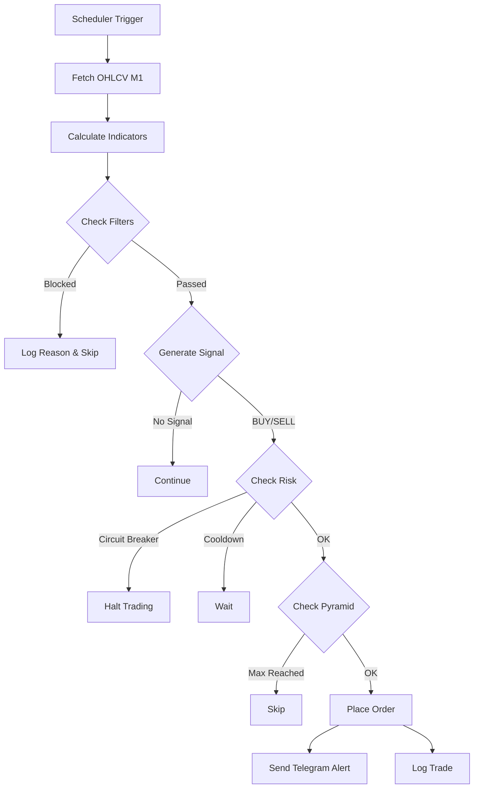

# 🥇 XAUUSD AGGRO V6 — Automated Scalping Bot

[](https://python.org)
[](https://www.metatrader5.com)
[]()

> **Fully automated M1 scalping bot** untuk XAUUSD (Gold) yang menggunakan
> kombinasi EMA Crossover, RSI Momentum, ATR Volatility, dan Donchian Channel
> Breakout. Dirancang untuk session London–New York (12:00–21:00 UTC) dengan
> multi-layer risk management.

---

## 📋 Daftar Isi

- [Fitur Utama](#-fitur-utama)
- [Strategy Overview](#-strategy-overview)
- [Quick Start](#-quick-start)
- [Konfigurasi](#-konfigurasi)
- [Arsitektur](#-arsitektur)
- [Risk Management](#-risk-management)
- [Notifikasi Telegram](#-notifikasi-telegram)
- [Testing](#-testing)
- [Troubleshooting](#-troubleshooting)
- [Risk Disclaimer](#-risk-disclaimer)

---

## ✨ Fitur Utama

### Strategy Engine
- **EMA Crossover** (5/13) — Identifikasi arah trend
- **RSI Momentum** (period 7) — Konfirmasi kekuatan momentum (>60 bull, <40 bear)
- **Donchian Channel Breakout** (period 10) — Entry trigger pada breakout
- **ATR-Based TP/SL/Trail** — Dynamic levels berdasarkan volatilitas aktual

### Smart Filters
- **Session Filter** — Hanya trading 12:00–21:00 UTC (London–NY overlap)
- **ATR Spike Filter** — Skip entry saat volatilitas abnormal (ATR > 2× average)
- **News Filter** — Blackout 15 menit sebelum & 10 menit setelah high-impact USD news

### Risk Management
- **Circuit Breaker 3-Tier** — Daily loss 3% (halt), 5% (emergency), equity 70% (shutdown)
- **Cooldown System** — 30 menit pause setelah 3 consecutive losses
- **Pyramid Control** — Maksimal 3 posisi simultan
- **Auto Force Close** — Semua posisi ditutup di 20:55 UTC

### Operations
- **Auto-Reconnect** — Reconnect otomatis jika MT5 terputus
- **Telegram Alerts** — Real-time notifikasi untuk setiap trade & event
- **Comprehensive Logging** — Structured logs dengan rotasi harian
- **Trailing Stop** — Dynamic trailing berdasarkan ATR (0.8×ATR distance)

---

## 📊 Strategy Overview

### Entry Conditions

| Kondisi | LONG (BUY) | SHORT (SELL) |
|---|---|---|
| EMA Crossover | EMA(5) > EMA(13) | EMA(5) < EMA(13) |
| Price Position | Close > EMA(5) | Close < EMA(5) |
| RSI Momentum | RSI(7) > 60 | RSI(7) < 40 |
| Donchian Breakout | High ≥ DonchianHigh[1] | Low ≤ DonchianLow[1] |

> **Semua 4 kondisi harus terpenuhi secara simultan** untuk menghasilkan sinyal.

### Exit Parameters

| Parameter | Formula | Keterangan |
|---|---|---|
| Take Profit | Entry ± 2.5 × ATR(10) | Target profit berdasarkan volatilitas |
| Stop Loss | Entry ∓ 1.2 × ATR(10) | Proteksi kerugian |
| Trail Distance | 0.8 × ATR(10) | Jarak trailing stop dari harga |
| Trail Offset | 0.3 × Trail Distance | Aktivasi trailing setelah profit ini |

### Contoh Skenario

```
Harga XAUUSD: 2650.00
ATR(10): 4.50

BUY Signal:
  TP = 2650.00 + (2.5 × 4.50) = 2661.25
  SL = 2650.00 - (1.2 × 4.50) = 2644.60
  Trail = 0.8 × 4.50 = 3.60
  Trail Offset = 0.3 × 3.60 = 1.08

  → Trailing mulai aktif saat profit ≥ $1.08
  → SL akan mengikuti harga dengan jarak $3.60
```

---

## 🚀 Quick Start

### Prerequisites

- **Windows 10/11** (64-bit) — MT5 hanya support Windows
- **Python 3.10+** (64-bit)
- **MetaTrader 5** terminal terinstall dan sudah login
- **Akun broker** yang support XAUUSD dan algorithmic trading

### Langkah Instalasi

```bash
# 1. Clone repository
git clone <repository-url> xauusd-aggro-v6
cd xauusd-aggro-v6

# 2. Buat virtual environment
python -m venv venv
venv\Scripts\activate

# 3. Install dependencies
pip install -r requirements.txt

# 4. Copy dan edit konfigurasi
copy .env.example .env
# Edit .env dengan credentials Anda (MT5 login, Telegram token)

# 5. Edit settings.yaml jika perlu (parameter sudah di-set default)
# Biasanya tidak perlu diubah untuk pertama kali

# 6. Buat folder logs
mkdir logs

# 7. Jalankan bot
python src/main.py
```

### Verifikasi Instalasi

```bash
# Test koneksi MT5
python -c "import MetaTrader5 as mt5; print(mt5.initialize()); mt5.shutdown()"
# Output: True

# Jalankan unit tests
pytest tests/ -v

# Jalankan dengan coverage
pytest --cov=src --cov-report=term-missing
```

---

## ⚙️ Konfigurasi

### File `.env` (Credentials — JANGAN commit ke Git!)

```env
# MetaTrader 5
MT5_LOGIN=12345678
MT5_PASSWORD=YourSecurePassword
MT5_SERVER=ICMarketsSC-Demo
MT5_TERMINAL_PATH=C:\Program Files\MetaTrader 5\terminal64.exe

# Telegram Bot
TELEGRAM_BOT_TOKEN=6123456789:AAHxxxxxxxxxxxxxxxxxxxxxxxxxxxxxxxxx
TELEGRAM_CHAT_ID=-1001234567890
```

### File `settings.yaml` (Parameter Strategi)

```yaml
# =========================================================
# XAUUSD AGGRO V6 — Strategy Configuration
# =========================================================

strategy:
  name: "AGGRO V6"
  symbol: "XAUUSD"
  timeframe: "M1"
  magic_number: 20260629

indicators:
  ema:
    fast_period: 5
    slow_period: 13
  rsi:
    period: 7
    bull_threshold: 60
    bear_threshold: 40
  atr:
    period: 10
    average_period: 100    # Untuk SMA(ATR) di spike filter
  donchian:
    period: 10

execution:
  lot_size: 0.02
  max_pyramid: 3           # Maksimal 3 posisi simultan
  tp_multiplier: 2.5       # TP = 2.5 × ATR
  sl_multiplier: 1.2       # SL = 1.2 × ATR
  trail_multiplier: 0.8    # Trail distance = 0.8 × ATR
  trail_offset_ratio: 0.3  # Trail offset = 0.3 × trail distance
  max_slippage_points: 30  # Max slippage yang diizinkan
  order_retry_attempts: 3
  order_retry_delay: 0.5   # Detik

filters:
  session:
    start_hour_utc: 12
    start_minute_utc: 0
    end_hour_utc: 21
    end_minute_utc: 0
    force_close_hour_utc: 20
    force_close_minute_utc: 55
  atr_spike:
    threshold: 2.0          # ATR > 2.0 × SMA(ATR) = spike
  news:
    pre_news_minutes: 15    # Blackout sebelum news
    post_news_minutes: 10   # Blackout setelah news
    impact_level: "high"    # Hanya filter news high-impact
    currency: "USD"

risk_management:
  circuit_breaker:
    daily_loss_pct: 3.0     # Halt trading jika loss > 3%
    emergency_loss_pct: 5.0 # Emergency stop jika loss > 5%
    equity_shutdown_pct: 70.0  # Shutdown jika equity < 70% balance
  cooldown:
    consecutive_losses: 3   # Trigger cooldown setelah 3 loss berturut
    cooldown_minutes: 30    # Durasi cooldown
  
notifications:
  telegram:
    enabled: true
    send_trade_alerts: true
    send_daily_report: true
    send_circuit_breaker: true
    daily_report_hour_utc: 21
    daily_report_minute_utc: 5

logging:
  level: "DEBUG"
  rotation: "00:00"        # Rotate setiap tengah malam
  retention: "30 days"
  compression: "zip"

mt5:
  timeout: 10000           # Timeout koneksi (ms)
  heartbeat_interval: 30   # Health check interval (detik)
```

---

## 🏗️ Arsitektur

### High-Level Architecture

```
┌─────────────────────────────────────────────────────────────┐
│                        MAIN LOOP                            │
│  ┌─────────┐    ┌──────────┐    ┌──────────┐    ┌────────┐ │
│  │ Scheduler│───►│ Strategy │───►│ Filters  │───►│Execute │ │
│  │ (1 min)  │    │ Engine   │    │ Manager  │    │ Orders │ │
│  └─────────┘    └──────────┘    └──────────┘    └────────┘ │
│       │              │               │               │      │
│       ▼              ▼               ▼               ▼      │
│  ┌─────────┐    ┌──────────┐    ┌──────────┐    ┌────────┐ │
│  │Trailing │    │Indicators│    │ Session  │    │ Risk   │ │
│  │ (5 sec) │    │EMA/RSI/  │    │ ATR Spike│    │Manager │ │
│  │         │    │ATR/Donch │    │ News     │    │        │ │
│  └─────────┘    └──────────┘    └──────────┘    └────────┘ │
│       │                                              │      │
│       ▼                                              ▼      │
│  ┌──────────────────────────────────────────────────────┐   │
│  │                  MT5 CONNECTOR                       │   │
│  │  connect / fetch_data / send_order / modify / close  │   │
│  └──────────────────────────────────────────────────────┘   │
│       │                                              │      │
│       ▼                                              ▼      │
│  ┌──────────┐                                 ┌──────────┐  │
│  │ Telegram │                                 │  Loguru   │  │
│  │ Notifier │                                 │  Logger   │  │
│  └──────────┘                                 └──────────┘  │
└─────────────────────────────────────────────────────────────┘
```

### Module Dependency Flow

```
main.py
├── utils/config.py          ← Load settings.yaml + .env
├── connectors/mt5_connector.py  ← MT5 connection management
├── core/
│   ├── indicators.py        ← EMA, RSI, ATR, Donchian calculations
│   ├── signals.py           ← Signal generation logic
│   └── strategy.py          ← Strategy orchestrator
├── filters/
│   ├── session.py           ← Time-based trading window
│   ├── atr_spike.py         ← Volatility spike detection
│   └── news.py              ← Economic calendar filter
├── execution/
│   ├── order_manager.py     ← Order CRUD operations
│   └── trailing.py          ← Trailing stop management
├── risk/
│   ├── circuit_breaker.py   ← Multi-tier loss protection
│   └── position_sizer.py    ← Lot sizing & pyramid control
└── notifications/
    └── telegram.py          ← Alert & reporting
```

### Data Flow (Per Tick Cycle)



---

## 🛡️ Risk Management

### Circuit Breaker System (3-Tier Protection)

```
Tier 1: DAILY LOSS > 3%
  → Stop opening new positions
  → Existing positions tetap berjalan (TP/SL/Trail aktif)
  → Auto-resume keesokan harinya

Tier 2: DAILY LOSS > 5% (EMERGENCY)
  → Close ALL positions immediately
  → Stop semua trading
  → Butuh manual restart setelah review

Tier 3: EQUITY < 70% of BALANCE (SHUTDOWN)
  → Close ALL positions immediately
  → SHUTDOWN bot completely
  → Butuh manual intervention untuk restart
  → Ini safety net terakhir untuk melindungi akun
```

### Consecutive Loss Protection

```
Loss 1 → Continue trading
Loss 2 → Continue trading (with warning log)
Loss 3 → COOLDOWN 30 menit
          → Resume otomatis setelah 30 menit
          → Counter reset setelah 1 win
```

### Position Limits

| Parameter | Value | Keterangan |
|---|---|---|
| Lot Size | 0.02 | Fixed, tidak di-scale |
| Max Pyramid | 3 | Maksimal 3 posisi simultan |
| Session | 12:00–21:00 UTC | Force close di 20:55 UTC |
| Max Slippage | 30 points | Tolak order jika slippage lebih |

---

## 📱 Notifikasi Telegram

### Setup Telegram Bot

1. Chat dengan [@BotFather](https://t.me/BotFather) di Telegram
2. Kirim `/newbot` dan ikuti instruksi
3. Simpan **Bot Token** yang diberikan
4. Buat group/channel dan tambahkan bot
5. Dapatkan **Chat ID** (gunakan [@userinfobot](https://t.me/userinfobot))
6. Masukkan token dan chat ID ke file `.env`

### Jenis Notifikasi

| Event | Emoji | Kapan Dikirim |
|---|---|---|
| Trade Opened | 🟢 / 🔴 | Setiap order berhasil |
| Trade Closed | ✅ / ❌ | Setiap posisi ditutup (TP/SL/Trail/Manual) |
| Circuit Breaker | ⚠️ | Saat circuit breaker aktif |
| Daily Report | 📊 | Setiap hari jam 21:05 UTC |
| Bot Started | 🚀 | Saat bot mulai berjalan |
| Bot Stopped | 🛑 | Saat bot berhenti (normal/error) |
| Force Close | ⏰ | Saat semua posisi di-force close |
| Reconnect | 🔄 | Saat MT5 reconnect setelah disconnect |

---

## 🧪 Testing

```bash
# Jalankan semua tests
pytest tests/ -v

# Jalankan dengan coverage report
pytest --cov=src --cov-report=term-missing --cov-fail-under=80

# Jalankan hanya unit tests
pytest tests/unit/ -v

# Jalankan hanya integration tests
pytest tests/integration/ -v

# Jalankan test spesifik
pytest tests/unit/test_indicators.py -v

# Generate HTML coverage report
pytest --cov=src --cov-report=html
# Buka htmlcov/index.html di browser
```

**Minimum Coverage Target: 80%**

---

## 🔧 Troubleshooting

### Masalah Umum

| Masalah | Solusi |
|---|---|
| `ModuleNotFoundError: MetaTrader5` | Pastikan pakai Python 64-bit, `pip install MetaTrader5` |
| MT5 initialize() return False | Cek MT5 terminal berjalan, login benar, algorithmic trading enabled |
| Order ditolak (requote) | Normal, bot akan auto-retry. Cek log untuk detail |
| Telegram pesan tidak terkirim | Cek bot token & chat ID, pastikan bot sudah di-add ke group |
| Bot tidak buka posisi | Cek: session filter, ATR spike, news blackout, circuit breaker, pyramid limit |
| "Not enough money" | Free margin tidak cukup, kurangi lot atau deposit |
| Data OHLCV return None | Market mungkin tutup (weekend/holiday), atau symbol salah |
| High memory usage | Cek buffer size, pastikan tidak ada memory leak di data manager |

### Log Files

```
logs/
├── aggro_v6_2026-06-29.log     # Log hari ini
├── aggro_v6_2026-06-28.log.zip # Log kemarin (compressed)
└── ...
```

Cek log untuk debugging:
```bash
# Lihat error terakhir
findstr /I "ERROR" logs\aggro_v6_2026-06-29.log

# Lihat semua trade
findstr /I "Order" logs\aggro_v6_2026-06-29.log

# Lihat circuit breaker events
findstr /I "circuit" logs\aggro_v6_2026-06-29.log
```

---

## ⚠️ Risk Disclaimer

> [!CAUTION]
> **PERINGATAN RISIKO — HARAP DIBACA DENGAN SEKSAMA**

### Bahasa Indonesia

**Trading forex dan komoditas (termasuk XAUUSD/Gold) mengandung risiko tinggi
dan TIDAK cocok untuk semua investor.** Kemungkinan besar Anda dapat kehilangan
sebagian atau SELURUH modal yang diinvestasikan.

- Bot ini adalah **alat bantu otomasi**, bukan jaminan profit.
- **Performa masa lalu TIDAK menjamin hasil di masa depan.**
- Selalu gunakan **uang yang Anda sanggup kehilangan** (risk capital).
- **JANGAN** trading dengan uang pinjaman, dana darurat, atau uang kebutuhan hidup.
- Selalu **test di demo account** terlebih dahulu sebelum menggunakan uang riil.
- **Leverage** dapat memperbesar keuntungan DAN kerugian secara signifikan.
- Kondisi market yang ekstrem (flash crash, gap, low liquidity) dapat menyebabkan
  kerugian melebihi stop loss yang di-set.
- Pengembang bot ini **TIDAK bertanggung jawab** atas kerugian finansial yang timbul
  dari penggunaan software ini.

### English

**Trading forex and commodities (including XAUUSD/Gold) carries a high level of
risk and may NOT be suitable for all investors.** You could lose some or ALL of
your invested capital.

- This bot is an **automation tool**, not a guarantee of profits.
- **Past performance does NOT guarantee future results.**
- Only trade with **money you can afford to lose** (risk capital).
- **DO NOT** trade with borrowed money, emergency funds, or living expenses.
- Always **test on a demo account** before using real money.
- **Leverage** can amplify both gains AND losses significantly.
- Extreme market conditions (flash crashes, gaps, low liquidity) may cause losses
  exceeding set stop-loss levels.
- The developers of this bot are **NOT responsible** for any financial losses
  incurred from the use of this software.

### Penggunaan yang Bertanggung Jawab

1. ✅ Mulai dengan **demo account** — jalankan minimal 2 minggu
2. ✅ Gunakan **lot size kecil** (0.01-0.02) saat awal live
3. ✅ Set **circuit breakers** sesuai toleransi risiko Anda
4. ✅ **Monitor** bot secara rutin, jangan tinggalkan tanpa pengawasan
5. ✅ Pahami **setiap parameter** sebelum mengubahnya
6. ❌ Jangan naikkan lot size hanya karena winning streak
7. ❌ Jangan disable circuit breakers
8. ❌ Jangan jalankan di live account tanpa testing yang memadai

---

## 📄 License

This project is **private and proprietary**. Unauthorized copying, distribution,
or modification is strictly prohibited.

---

## 📞 Support

Jika mengalami masalah atau butuh bantuan:

1. Cek bagian [Troubleshooting](#-troubleshooting) terlebih dahulu
2. Periksa log files di folder `logs/`
3. Review konfigurasi di `settings.yaml` dan `.env`
4. Buka issue di repository (jika applicable)

---

> **Version:** 1.0.0
> **Strategy:** AGGRO V6 — XAUUSD M1 Donchian Breakout Scalper
> **Magic Number:** 20260629
> **Last Updated:** 2026-06-29
